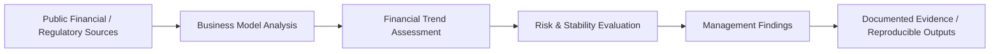

# Digital Banking Stability Assessment — Analytical Architecture

## Operating model

## Control principles

| Control area | Standard |
|---|---|
| Source integrity | Inputs are documented and traceable to their stated source or repository dataset. |
| Transformation | Material cleaning, joins, assumptions and feature logic remain reproducible. |
| Validation | Analytical outputs are checked against an explicit benchmark, framework or validation step. |
| Evidence | Reports, figures and notebooks preserve the reasoning behind conclusions. |
| Reproducibility | Code and dependency information are kept separate from generated outputs. |
| Governance | Limitations, data restrictions and non-advisory scope are stated where applicable. |

## Repository boundary

This repository is an analytical reference implementation. Results should be interpreted within the period, population and assumptions documented in the project. Any use in a production decision process would require refreshed data, independent validation, access controls and appropriate model/risk governance.
